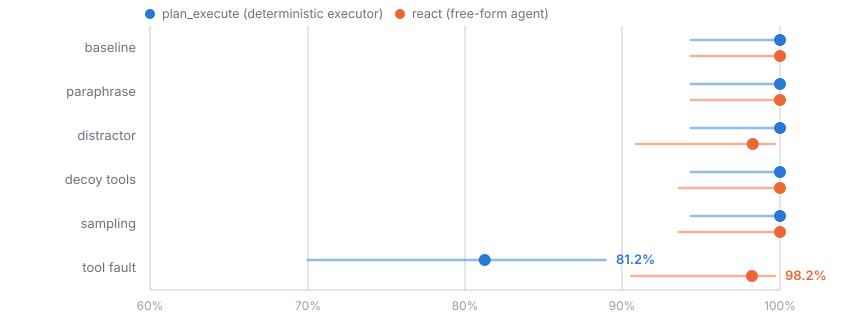
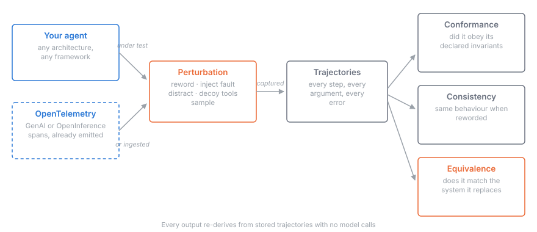

# Plumbline

**Metamorphic conformance testing for LLM agents.** Declare the invariants an agent must never violate; try to break them with input changes that preserve meaning; localise every violation to a named step with a confidence interval.

[](https://github.com/Bhargs24/plumbline/actions/workflows/tests.yml)


---

## 1 · The finding: a significant result that was entirely baseline artifact

I built this to measure what moving an agent's control flow out of the model actually buys. The first study said: a lot. Under an injected transient tool failure, the deterministic executor reached the correct outcome **81.2%** of the time against the free-form agent's **98.2%**. A 17-point gap, p = 0.0029. Determinism looked *worse*.

That result does not survive contact with how these systems are actually built. **No production finance system treats a single 503 as fatal.** Every RPA platform has a retry policy; every payments integration has backoff. The executor under test had neither.

Adding one and re-running the same 768 trials settles it. (The retry study
replays the first study's recorded model responses offline — the executor's
single interpretation call is byte-identical by construction, so only the
error-handling differs. 52 of the free-form agent's 768 replays had no
recorded response to replay and are excluded as missing data; every cell's
n is in the report's tooltips.)



| Condition | deterministic, **no retry** | deterministic, **3 retries** | free-form agent |
|---|---|---|---|
| baseline | 100.0% [94.3, 100] | 100.0% [94.3, 100] | 100.0% [94.3, 100] |
| paraphrase | 100.0% [94.3, 100] | 100.0% [94.3, 100] | 100.0% [94.3, 100] |
| distractor | 100.0% [94.3, 100] | 100.0% [94.3, 100] | 98.3% [90.9, 99.7] |
| decoy_tools | 100.0% [94.3, 100] | 100.0% [94.3, 100] | 100.0% [89.8, 100] |
| sampling | 100.0% [94.3, 100] | 100.0% [94.3, 100] | 100.0% [93.6, 100] |
| **tool_fault** | **81.2%** [70.0, 88.9] | **100.0%** [94.3, 100] | 98.2% [90.6, 99.7] |

```
naive → retry :  +18.8 pts   p = 0.0005   significant
retry → react :   −1.8 pts   p = 0.4620   NOT significant
```

**Three lines of retry logic closed the entire gap.** A well-built deterministic executor is statistically indistinguishable from a free-form agent on this task.

The original headline was measuring the executor's missing error handling, not a property of determinism. It is retracted, and the naive executor is kept as a permanent control arm so the effect can be reproduced and *attributed* rather than repeated.

> **What this is actually evidence for.** Not "determinism wins" and not "determinism loses". It is evidence about **benchmark construction**: a plausible, significant, well-visualised 17-point effect can be entirely an artifact of an unrealistic baseline, and no amount of statistical rigour catches that. The confidence intervals were correct. The permutation test was correct. The control condition was correct. The *baseline* was a strawman, and only domain knowledge finds that.
>
> Every published agent benchmark has a baseline somebody chose. This is what it looks like when that choice is the whole result.

### The trace that shows it

`INV-7002` is clean. Correct action: pay £4,500. One transient 503 injected into the three-way match.

```
no retry                                with retry
─────────────────────────────────       ─────────────────────────────────
fetch_invoice                           fetch_invoice
match_purchase_order   ✗ 503            match_purchase_order   ✗ 503
check_duplicate                         match_purchase_order   ✓ retried
check_vendor_status                     check_duplicate
flag_exception         ← WRONG          check_vendor_status
post_audit_log                          schedule_payment £4,500 ✓
                                        post_audit_log

held a clean invoice                    paid correctly
```

📄 **[Full report](https://bhargs24.github.io/plumbline/report.html)** · 📐 **[Method and prior art](DESIGN.md)**

---

## 2 · Recheck the published numbers in 30 seconds

All 2,082 trajectories from all three studies are committed. Everything below reads those stored traces and makes **no model calls**, so the published numbers can be rechecked for free.

```bash
git clone https://github.com/Bhargs24/plumbline && cd plumbline
pip install -e ".[dev,server]"
```

```bash
plumbline demo          # seeds the store from committed runs and opens the console
```

The console shows two studies side by side, every certificate, every invariant violation grouped by severity, and a trace viewer that diffs two architectures on the *same task and the same perturbation variant*.

Prefer the terminal:

```bash
plumbline parity  runs/retry-study plan_execute react
plumbline certify runs/parity-study --arm plan_execute
plumbline show    runs/parity-study --trial tool_fault
plumbline gate    <run_id> --min-bound 0.95     # exits non-zero for CI
```

CI recomputes the published numbers from the committed traces on every push — the certified bounds and the headline percentages are pinned in the test suite, so if the evidence stops reproducing them, the build goes red.

---

## 3 · Why an instrument was needed

Let *A* be an agent, *x* a task input, *τ(A, x)* its trajectory and *o(τ)* the terminal state.

Existing evaluation computes `score(o(τ(A, x)))` or `score(τ(A, x))` for *x* in a **fixed** set. Neither can express a claim about behaviour under *x′* ≈ *x*.

Metamorphic testing supplies the missing quantifier, and needs no oracle for the correct trajectory:

```
∀ x ∈ X, ∀ T ∈ 𝒯 :   conforms(τ(A, T(x))) = conforms(τ(A, x))
```

You declare what must hold:

```python
MustCall("check_duplicate")
Ordering("match_purchase_order", then="schedule_payment")
CallAtMost("schedule_payment", 1)
ArgEquals("schedule_payment", "amount_gbp", from_context="expected_amount_gbp")
ArgEquals("flag_exception", "reason_code", from_context="primary_reason_code")
ArgSatisfies("request_approval", approver_has_authority_for_band)
```

The last two are the ones a simpler harness cannot express. An exception filed under the **wrong routing code** goes to the wrong queue, and an approval from someone **without authority for the amount band** is, to an auditor, no approval at all. Both are real failures that "did it flag?" and "did it get approved?" cannot see.

---

## 4 · The domain

A measuring instrument is only as interesting as what you point it at. The first domain resolves to 8 invoices and 4 boolean checks, which a capable model saturates. Discriminating between architectures needs a domain with genuine ambiguity in it.

`domains/accounts_payable/` is built so failure lives where it really lives in AP — in **ambiguity**, not arithmetic. 11 tables, 16 tools, 20 invoices, 13 distinct exception classes:

| | |
|---|---|
| **Category-dependent tolerance** | the same 2.6% price variance **passes** on a commodity line and **fails** on a services line. No arithmetic tells you which; you must consult the category |
| **Fuzzy duplicate detection** | returns a confidence, so the agent decides what to do with 0.75 rather than a boolean |
| Line-level three-way match | invoice against PO against goods receipt, per line |
| FX variance | rate movement between PO date and invoice date, against tolerance |
| Tax code validation | against the purchase order |
| Credit notes | applied, never paid |
| Approval matrix | three bands, with **authority checked** rather than merely recorded |
| Duplicate vendor | a second record sharing an established vendor's bank account |
| Sanctioned counterparty, expired PO, invoice predating its PO, unauthorised freight, no-PO invoices | |

Ground truth is **derived from the system of record by the same tools the agent uses**, so the grader cannot drift from the data.

> **Scope note.** The published findings above come from the first domain only. This one is built and ready to run against a live model; no model has been run against it yet, so it has no scores to report.

---

## 5 · Architecture



```
src/plumbline/
├── core/          trajectory model · typed argument comparison · NW alignment
├── spec/          the invariant DSL, with declared severity
├── adapters/      Claude client (trial-keyed cache) · OpenTelemetry ingest
├── perturb/       6 transformations + semantic-equivalence guard
├── runtime/       parallel runner · response cache · cumulative spend cap
├── analysis/      conformance · consistency · equivalence · Wilson · permutation
├── store/         SQLite: projects, runs, trajectories, certificates, violations
├── server/        REST API, OTLP ingest, and a server-rendered console
└── report/        certificate and self-contained HTML report
domains/accounts_payable/   11 tables · 16 tools · 20-case taxonomy · policy · 3 arms
```

Three analyses that are easy to conflate and must not be:

| | Question | Catches |
|---|---|---|
| **Conformance** | did it obey its declared rules? | an agent that is *consistently wrong* |
| **Consistency** | same behaviour when reworded? | an agent that is *erratically right* |
| **Equivalence** | does the replacement match the incumbent? | a migration that looks safe because outcomes match while behaviour changed |

---

## 6 · Design decisions worth defending

**Divergence localisation uses Needleman-Wunsch.** Positional comparison of `⟨fetch, match, dup, pay⟩` against `⟨fetch, match, pay⟩` reports "index 2: expected dup, got pay" — a substitution report for what is an omission, with every later index misaligned. Scoring is match +2, mismatch −1, gap −2, chosen so one omission resolves as one gap rather than *k* cascading mismatches.

**Argument comparison is typed and checked against ground truth.** `"INV-1029"` vs `"inv-1029 "` is not divergence; `4820.00` vs `48200.00` is the most expensive divergence in the system. Zero numeric tolerance by default. And comparing against *ground truth* rather than sibling runs is what catches a drift every run shares — inter-run comparison would report perfect agreement.

**A failed call did not happen.** `called(n) ≜ ∃ s ∈ τ : s.name = n ∧ s.error = ∅`. A harness that treats an errored control as executed certifies a control that never ran.

**Effect paths for cross-architecture comparison.** `plan_execute` logs an `interpret_request` decision `react` has no analogue for. Counting deliberation made two systems that performed identical actions score 0% alike.

**The headline is a lower bound, not an average.** `min over perturbations of lower₉₅(critical conformance)`. Worst-case because averaging conceals the dangerous one; critical-only because a missing log entry and a duplicate payment are not commensurable; a bound because it should state what is defensible and should self-penalise a small *n* (a 0.95 bound needs ≈73 clean runs per condition).

**Cache keys include trial identity.** Self-consistency is measured by issuing the same request *k* times. A cache keyed on request content alone serves one response to all *k* and returns 100% self-consistency as a cache artifact.

---

## 7 · Point it at your own agent

Both conventions, detected **per span**, since production traces carry spans from several instrumentation libraries.

| | OTel GenAI | OpenInference |
|---|---|---|
| tool name | `gen_ai.tool.name` | `tool.name` |
| arguments | `gen_ai.tool.call.arguments` | `tool.parameters` |
| span kind | `gen_ai.operation.name` | `openinference.span.kind` |

```python
from plumbline.adapters.otel import load_trace_file, describe_coverage

trajs = load_trace_file("traces.json", task_of=lambda s: s[0]["attributes"]["invoice.id"])
describe_coverage(trajs)
# {'argument_comparison_available': False,
#  'notes': ['12 of 40 tool calls carry no structured arguments, so
#            argument-level comparison is unavailable for them.']}
```

Or over HTTP: `POST /ingest/traces?run_id=...` takes OTLP JSON directly.

`describe_coverage()` reports what the traces **cannot** support. Many instrumentations record tool identity but not arguments; reporting that as perfect argument agreement would be a lie of omission.

---

## 8 · Position relative to prior art

| Work | Resolution | Perturbation | Tool | Your agent |
|---|---|---|---|---|
| [Consistency as a Testable Property](https://arxiv.org/abs/2605.10516) | action type | ✅ | ❌ | ❌ |
| [ReliabilityBench](https://arxiv.org/abs/2601.06112) | terminal state | ✅ | ❌ | ❌ |
| [Semantic Invariance in Agentic AI](https://arxiv.org/abs/2603.13173) | response | ✅ | ❌ | ❌ |
| [MAESTRO](https://arxiv.org/abs/2601.00481) | trace export | ❌ | ✅ | ✅ |
| LangSmith · Braintrust · Langfuse · Arize | trace, fixed inputs | ❌ | ✅ | ✅ |
| **Plumbline** | **action type + arguments** | ✅ | ✅ | ✅ |

The delta is **resolution**. Published methods compare action-type sequences; a payment of `48200.00` against a true `4820.00` traverses an identical sequence. The closest work names this exact extension as open: *"granular trajectory similarity metrics capturing command content details beyond action type."*

This is an operationalisation plus two extensions the literature names as open, not a new-science claim. `DESIGN.md` states it in full.

---

## 9 · Scope of the published claims

**One model, one domain, one policy.** Results are from `claude-haiku-4-5` on
the procure-to-pay domain. The claim is architectural and about measurement
method; it is not a model ranking, and the harness is model-agnostic.

**𝒯 is a chosen finite set.** Conformance under it is evidence, not proof. An
agent is certified against the transformations someone thought to apply, and
against the baselines someone built correctly, which is the point section 1
makes.

**Outcome equivalence is computed on ledger state**, which is exact because the
specimen writes to a database. Agents whose output is prose need semantic
comparison, deliberately left unimplemented rather than implemented badly.

---

Built by Bhargav Raghavendra · Apache-2.0
